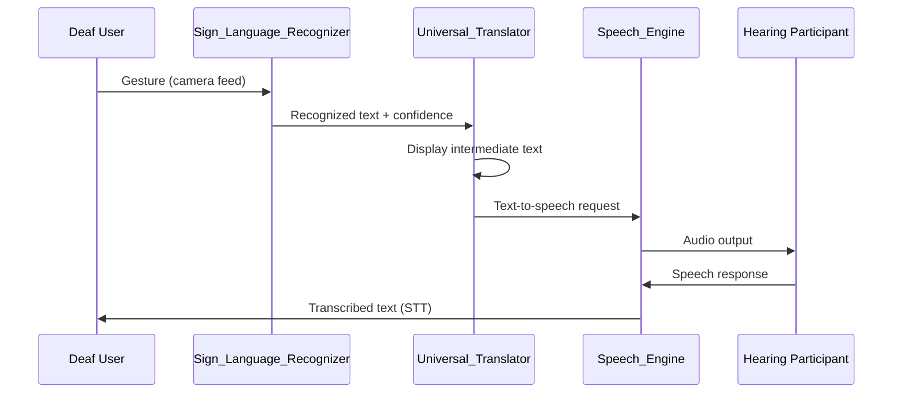

# Design Document: UnifyTalk Accessible Communication Platform

## Overview

The Accessible Communication Platform is a React 18 + Tailwind CSS PWA that enables seamless communication for differently-abled users — Deaf/Hard of Hearing, Mute/Non-verbal, and Blind/Visually Impaired — in everyday life. It is not a medical application; it is a general-purpose communication companion.

The platform delivers AI-powered sign language recognition (MediaPipe Hands), speech synthesis and transcription (Web Speech API, Google STT, ElevenLabs), augmentative and alternative communication (AAC) pictogram boards, screen reader compatibility (WCAG 2.1 AA), voice navigation, real-time multilingual chat (Firebase), and a community forum — all built with accessibility as a first-class architectural concern.

### Key Design Principles

- **Accessibility first**: Every interaction must be reachable via touch, keyboard, voice, or screen reader. WCAG 2.1 AA minimum; AA+ where feasible.
- **Offline resilience**: Critical paths (pictogram board, pre-saved phrases, SOS) work offline via Service Worker cache and IndexedDB queuing.
- **Modular feature slices**: Each named subsystem (Sign_Language_Recognizer, Speech_Engine, AAC_Board, etc.) is an isolated React feature slice with its own service layer and Firestore collection path.
- **AI as enhancement, not dependency**: If Claude API or ElevenLabs fails, the platform falls back to Web Speech API or text-only mode.
- **Privacy by design**: On-device ML (MediaPipe WASM) is preferred over cloud APIs. Gesture data collection is consent-gated. Analytics are anonymized.

---

## Architecture

```mermaid
graph TD
    subgraph Client ["React 18 PWA (Vite + Tailwind)"]
        Shell[Accessible UI Shell + Bottom Nav]
        AP[AccessibilityProvider - font/contrast/theme]
        Router[React Router DOM 6]

        subgraph Phase1["Phase 1 - Foundation"]
            Onboard[Onboarding Flow]
            Dashboard[Home Dashboard]
        end

        subgraph Phase2["Phase 2 - Communication Core"]
            PB[AAC_Board - Pictogram Board]
            TTS[TTS_Engine - Type-to-Speak]
            QS[Quick_Speak Panel]
        end

        subgraph Phase3["Phase 3 - Sign Language + Captions"]
            SLR[Sign_Language_Recognizer - MediaPipe]
            LC[Live_Captions - Web Speech API]
            UT[Universal_Translator]
        end

        subgraph Phase4["Phase 4 - Chat + Translation"]
            Chat[Accessible_Chat]
            MT[Multilingual_Translator - ML Kit]
        end

        subgraph Phase5["Phase 5 - Screen Reader + Community"]
            VN[Voice_Navigator]
            BO[Braille_Output]
            CF[Community_Forum]
        end

        subgraph Phase6["Phase 6 - Extra Features"]
            AI[AI_Assistant - Claude]
            ITS[Image_to_Speech - Claude Vision]
            SNI[Sound_Notification_Interpreter]
            CCM[Caregiver_Companion_Mode]
            AACB[AAC_Board_Builder]
            SLL[Sign_Language_Learning]
            SOS[SOS_Service]
            PT[Progress_Tracker]
        end
    end

    subgraph Firebase
        Auth[Firebase Auth]
        FS[Firestore]
        Storage[Firebase Storage]
        FCM[Firebase Cloud Messaging]
    end

    subgraph ExternalAPIs ["External APIs / ML"]
        Claude[Claude API]
        MediaPipe[MediaPipe Hands WASM]
        WebSpeech[Web Speech API]
        GoogleSTT[Google STT]
        ElevenLabs[ElevenLabs TTS]
        GoogleTranslate[Google Translate API]
        MLKit[Google ML Kit - offline]
    end

    Shell --> AP & Router
    Router --> Onboard & Dashboard & PB & TTS & SLR & LC & Chat & VN & CF & AI & SOS & PT
    PB --> FS
    Chat --> FS & Auth
    SLR --> MediaPipe
    LC --> WebSpeech & GoogleSTT
    TTS --> WebSpeech & ElevenLabs
    AI --> Claude
    ITS --> Claude
    MT --> MLKit & GoogleTranslate
    SOS --> FCM & FS
    Auth --> FS
```



### Data Flow: Universal Translator Pipeline



---

## Components and Interfaces

### AccessibilityProvider

Global React context that manages and persists all accessibility preferences.

```typescript
interface AccessibilityPreferences {
  fontSize: 'small' | 'medium' | 'large' | 'extra-large'; // 14/18/24/32px
  contrastMode: 'normal' | 'high-contrast' | 'dark';
  flashIntensity: 'subtle' | 'moderate' | 'strong';
  audioSpeed: number;           // 0.5 – 2.0
  voiceGender: 'male' | 'female' | 'neutral';
  voiceLanguage: string;        // BCP-47 language tag
  ttsEnabled: boolean;
  voiceNavigationEnabled: boolean;
  disabilityTypes: DisabilityType[];
  preferredCommunicationMode: CommunicationMode;
}

type DisabilityType = 'deaf' | 'hard-of-hearing' | 'mute' | 'non-verbal' | 'blind' | 'low-vision';
type CommunicationMode = 'pictogram' | 'text' | 'sign-language' | 'voice';
```

### Sign_Language_Recognizer

Wraps MediaPipe Hands WASM for on-device gesture recognition.

```typescript
interface GestureRecognitionResult {
  text: string;
  confidence: number;       // 0.0 – 1.0
  language: SignLanguage;
  timestamp: number;
  landmarks: HandLandmark[];
}

type SignLanguage = 'ASL' | 'BSL' | 'ISL';

interface SignLanguageRecognizerConfig {
  language: SignLanguage;
  confidenceThreshold: number;  // default 0.7
  collectGestureData: boolean;  // consent-gated
}
```

### Speech_Engine

Unified interface over Web Speech API, Google STT, and ElevenLabs.

```typescript
interface SpeechEngineConfig {
  sttProvider: 'web-speech' | 'google-stt';
  ttsProvider: 'web-speech' | 'elevenlabs';
  language: string;
  voiceId?: string;
  speechRate: number;
  volume: number;
}

interface TranscriptionResult {
  text: string;
  isFinal: boolean;
  confidence: number;
  language: string;
}

interface TTSRequest {
  text: string;
  voiceId?: string;
  speechRate?: number;
  volume?: number;
}
```

### AAC_Board

```typescript
interface Pictogram {
  id: string;
  label: string;
  phrase: string;
  category: PictogramCategory;
  svgPath: string;
  ariaLabel: string;
  isCustom: boolean;
}

type PictogramCategory =
  | 'greetings' | 'needs' | 'emotions' | 'actions'
  | 'food' | 'people' | 'places' | 'activities' | 'emergency';

interface AACBoardConfig {
  userId: string;
  pictograms: Pictogram[];
  layout: 'grid-3' | 'grid-4' | 'grid-5';
  ttsOnTap: boolean;
}
```

### Pre-saved Phrases

```typescript
interface SavedPhrase {
  id: string;
  text: string;           // max 500 characters
  label: string;          // display name
  order: number;
  createdAt: Timestamp;
}
```

### Community_Forum

```typescript
interface ForumPost {
  id: string;
  authorId: string;
  content: string;
  attachments: MediaAttachment[];
  reactions: Record<string, string[]>; // emoji -> userId[]
  flaggedBy: string[];    // userId[]
  isHidden: boolean;
  createdAt: Timestamp;
}

interface MediaAttachment {
  type: 'image' | 'audio' | 'video';
  url: string;
  altText?: string;       // required for images
  captionUrl?: string;    // required for audio/video
}
```

### SOS_Service

```typescript
interface SOSAlert {
  userId: string;
  contacts: EmergencyContact[];
  location?: GeolocationCoordinates;
  timestamp: Timestamp;
  locationAvailable: boolean;
}

interface EmergencyContact {
  name: string;
  phone: string;
  email: string;
  notificationMethod: 'sms' | 'email' | 'fcm';
}
```

### Progress_Tracker

```typescript
interface PracticeSession {
  id: string;
  userId: string;
  type: 'sign-language' | 'speech-therapy';
  date: Timestamp;
  durationSeconds: number;
  accuracyScore: number;  // 0.0 – 1.0
}

interface ProgressSummary {
  period: '7d' | '30d' | 'all';
  totalSessions: number;
  totalDurationSeconds: number;
  averageAccuracy: number;
  milestoneReached: boolean;
}
```

### Voice_Navigator

```typescript
interface VoiceCommand {
  utterance: string;
  action: NavigationAction;
  aliases: string[];
}

type NavigationAction =
  | 'navigate:home' | 'navigate:messages' | 'navigate:settings'
  | 'navigate:pictogram' | 'navigate:community' | 'navigate:sos'
  | 'action:send' | 'action:speak' | 'action:help';
```

---

## Data Models

### Firestore Collections

```
/users/{userId}
  - profile: UserProfile
  - preferences: AccessibilityPreferences
  - emergencyContacts: EmergencyContact[]
  - savedPhrases: SavedPhrase[]
  - aacBoardConfig: AACBoardConfig
  - analyticsConsent: boolean
  - gestureDataConsent: boolean

/users/{userId}/sessions/{sessionId}
  - PracticeSession

/chats/{chatId}
  - participants: string[]
  - createdAt: Timestamp

/chats/{chatId}/messages/{messageId}
  - senderId: string
  - content: string
  - type: 'text' | 'pictogram' | 'voice'
  - translatedContent?: Record<string, string>
  - timestamp: Timestamp

/forum/posts/{postId}
  - ForumPost

/forum/posts/{postId}/replies/{replyId}
  - ForumPost (subset)

/gestures/{userId}/sessions/{sessionId}
  - GestureRecognitionResult[]
  - consentVersion: string

/analytics/events/{eventId}
  - feature: string
  - action: string
  - sessionDuration?: number
  - timestamp: Timestamp
  // NO userId field — fully anonymized

/sos/alerts/{alertId}
  - SOSAlert
```

### Local Storage / IndexedDB (Offline)

```
pictograms_cache        — full pictogram dataset (100+ symbols)
saved_phrases_cache     — user's saved phrases
preferences_cache       — accessibility preferences
pending_sos_queue       — SOS alerts queued when offline
pending_messages_queue  — chat messages queued when offline
```

---

## Correctness Properties

*A property is a characteristic or behavior that should hold true across all valid executions of a system — essentially, a formal statement about what the system should do. Properties serve as the bridge between human-readable specifications and machine-verifiable correctness guarantees.*

### Property 1: User Profile Round Trip

*For any* valid combination of disability type, communication mode, and language, creating a User_Profile and then loading it should return a profile with all fields identical to the saved values.

**Validates: Requirements 1.1, 1.2, 1.3**

---

### Property 2: Accessibility Settings Propagation

*For any* accessibility preference update (font size, contrast mode, audio speed), the change should be immediately reflected in the rendered DOM without a page reload, and the persisted value should match the applied value.

**Validates: Requirements 1.3, 11.3**

---

### Property 3: Sign Language Recognition Output Completeness

*For any* gesture recognition result produced by the Sign_Language_Recognizer, the rendered output must contain both the recognized text and a confidence indicator.

**Validates: Requirements 2.3**

---

### Property 4: Gesture Data Consent Enforcement

*For any* sign language session, gesture data SHALL be appended to the Gesture_Dataset if and only if the user has given explicit consent. Sessions without consent must produce zero dataset entries.

**Validates: Requirements 2.5, 24.1, 24.2**

---

### Property 5: Speech Transcription Display Compliance

*For any* transcription result produced by the Speech_Engine, the rendered text element must have a computed font size of at least 16px and a contrast ratio meeting WCAG 2.1 AA (≥ 4.5:1 for normal text).

**Validates: Requirements 3.3**

---

### Property 6: TTS Speech Rate Propagation

*For any* valid speech rate value set in accessibility preferences, all subsequent TTS requests in the same session must use that exact rate value.

**Validates: Requirements 4.3**

---

### Property 7: Pictogram Tap Phrase Correctness

*For any* pictogram in the AAC_Board, tapping it must display the phrase text that is associated with that pictogram in the board configuration — no pictogram may display a phrase belonging to a different pictogram.

**Validates: Requirements 5.2**

---

### Property 8: AAC Board CRUD Round Trip

*For any* pictogram added to the AAC_Board, it must appear in the board after addition. After deletion, it must not appear. After editing, the updated label and phrase must be reflected.

**Validates: Requirements 5.3, 5.4**

---

### Property 9: Pre-saved Phrase Limit and Insertion

*For any* list of saved phrases with count ≤ 100, all phrases must be saveable. Attempting to save a 101st phrase must be rejected. For any saved phrase, selecting it must insert the exact phrase text into the active input field.

**Validates: Requirements 6.1, 6.2, 6.3**

---

### Property 10: Emotion Icon Accessibility

*For any* emotion icon rendered in the emotion selector, it must have both a non-empty `aria-label` attribute and a visible text label. Selecting any emotion icon must display the correct emotion label text.

**Validates: Requirements 7.2, 7.3**

---

### Property 11: Image Alt Text Rendering

*For any* image rendered on the platform that has an associated alt text description, the rendered `` element must have the `alt` attribute set to that description. Images without alt text must render with the placeholder label "Image — no description provided".

**Validates: Requirements 8.2, 12.2, 12.3**

---

### Property 12: ARIA Live Region Coverage

*For any* dynamic content update (new message, alert, transcription result), the update must occur within a DOM element that has an `aria-live` attribute set to `polite` or `assertive`.

**Validates: Requirements 8.3**

---

### Property 13: Visual Flash Rate Compliance

*For any* visual alert animation triggered by the notification system, the interval between consecutive flashes must be at least 333ms (≤ 3 flashes per second), regardless of flash intensity setting.

**Validates: Requirements 13.1, 13.3**

---

### Property 14: High Contrast Mode Contrast Ratio

*For any* text element rendered when high contrast mode is active, the computed contrast ratio between foreground and background colors must be ≥ 4.5:1 for normal text (< 24px) and ≥ 3:1 for large text (≥ 24px).

**Validates: Requirements 11.1**

---

### Property 15: Font Size Setting Application

*For any* font size setting selected (small/medium/large/extra-large), all body text elements must render at the corresponding pixel size (14/18/24/32px respectively).

**Validates: Requirements 11.2**

---

### Property 16: Universal Translator Pipeline Completeness

*For any* sign language gesture input processed in Universal Translator Mode, the pipeline must produce both a text output (displayed on screen) and an audio output (TTS). If any stage fails, the platform must fall back to text-only mode.

**Validates: Requirements 16.1, 16.2, 16.4**

---

### Property 17: Buddy Match Criteria Satisfaction

*For any* user requesting a buddy match, the matched volunteer must share a compatible disability type support and language preference with the requesting user.

**Validates: Requirements 17.1, 17.2**

---

### Property 18: SOS Button Ubiquity

*For any* page rendered in the application, the SOS button must be present in the DOM and visible. For any user with zero designated emergency contacts, the SOS button must be disabled or show a setup prompt rather than sending an alert.

**Validates: Requirements 19.1, 19.3**

---

### Property 19: SOS Confirmation Completeness

*For any* SOS activation, the confirmation screen must display the list of notified contacts and the timestamp of the alert.

**Validates: Requirements 19.4**

---

### Property 20: Progress Session Recording

*For any* completed practice session, the stored record must contain the date, duration in seconds, and accuracy score. The 7-day, 30-day, and all-time summaries must correctly aggregate only sessions within their respective time windows.

**Validates: Requirements 20.1, 20.2**

---

### Property 21: Milestone Notification Threshold

*For any* completed session where the accuracy score meets or exceeds the user's configured threshold (default 0.8), a milestone notification must be generated. Sessions below the threshold must not generate milestone notifications.

**Validates: Requirements 20.3**

---

### Property 22: Forum Post Moderation

*For any* forum post that has been flagged by 3 or more distinct users, the post must not be visible to non-moderator users. Posts flagged by fewer than 3 users must remain visible.

**Validates: Requirements 21.2**

---

### Property 23: Forum Media Accessibility Requirement

*For any* forum post with an image attachment, the post must not be submittable without a non-empty alt text for that image.

**Validates: Requirements 21.4**

---

### Property 24: Analytics Consent Enforcement

*For any* user with analytics consent set to false, no analytics events must be recorded for that user's actions. For any analytics event stored, the record must contain no user-identifying fields (no userId, email, or name).

**Validates: Requirements 22.2, 22.3, 22.4**

---

### Property 25: Feedback Rating Aggregation Correctness

*For any* set of session feedback ratings, the aggregated average displayed in the admin dashboard must equal the arithmetic mean of all submitted ratings, rounded to two decimal places.

**Validates: Requirements 23.3**

---

### Property 26: AI Assistant Persistent Availability

*For any* page rendered in the application, the AI_Assistant entry point (button or floating action) must be present in the DOM.

**Validates: Requirements 18.1**

---

## Error Handling

### Graceful Degradation Hierarchy

| Failing Component | Fallback Behavior |
|---|---|
| MediaPipe / Sign Language | Show "gesture not recognized" prompt; offer text input |
| ElevenLabs TTS | Fall back to Web Speech API SynthesisUtterance |
| Google STT | Fall back to Web Speech API SpeechRecognition |
| Claude API | Show "AI unavailable" message; retain user input |
| Firebase Firestore | Queue writes to IndexedDB; sync on reconnect |
| Location Services (SOS) | Send alert without coordinates; notify user |
| Braille Display Disconnect | Visual + audio notification; continue without braille |
| Caption Generation Failure | Notify uploader; offer manual SRT/VTT upload |
| Video Relay Disconnect | Auto-reconnect attempt; notify user of attempt |

### Error Display Standards

- All error messages must be displayed in a high-contrast alert component with an ARIA `role="alert"` attribute.
- Error messages must be descriptive and suggest corrective actions (not just "something went wrong").
- Errors must not cause loss of user-typed content — all input fields retain their value on error.
- Network errors trigger offline mode indicators in the UI shell.

### Input Validation

- Pre-saved phrases: max 500 characters — validated client-side before any API call.
- Pictogram labels: max 100 characters.
- Forum posts: content moderation check before submission.
- Image uploads: alt text required before upload is finalized.
- Audio/video uploads: captions required before publishing.

---

## Testing Strategy

### Dual Testing Approach

The platform uses both unit/example-based tests and property-based tests (PBT) for comprehensive coverage.

**Unit Tests** focus on:
- Specific component rendering examples
- Integration points between services
- Edge cases and error conditions (low confidence gestures, TTS failure, offline mode)
- Accessibility audit snapshots (axe-core)

**Property-Based Tests** focus on:
- Universal properties that hold across all valid inputs (see Correctness Properties section)
- Data round-trips (profile save/load, AAC board config, phrase insertion)
- Invariants (consent enforcement, flash rate, contrast ratios, font sizes)
- Aggregation correctness (progress summaries, rating averages)

### PBT Library

**fast-check** (TypeScript) — used for all property-based tests.

Each property test runs a minimum of **100 iterations**.

Tag format for each test:
```
// Feature: accessible-communication-platform, Property N: <property_text>
```

### Test Coverage by Phase

**Phase 1 — Foundation**
- Unit: AccessibilityProvider renders correct CSS variables for each font size and contrast mode
- Unit: Onboarding flow saves disability type and communication mode to Firestore
- PBT: Property 1 (profile round trip), Property 2 (settings propagation)

**Phase 2 — Communication Core**
- Unit: Pictogram board renders all 9 categories with correct ARIA labels
- Unit: Quick Speak panel inserts phrase on selection
- PBT: Property 7 (pictogram tap), Property 8 (AAC CRUD), Property 9 (phrase limit/insertion)

**Phase 3 — Sign Language + Captions**
- Unit: Low-confidence gesture shows retry prompt
- Unit: Live captions display in ARIA live region
- PBT: Property 3 (recognition output completeness), Property 4 (gesture consent), Property 16 (pipeline completeness)

**Phase 4 — Chat + Translation**
- Unit: Offline message queuing and sync
- Unit: TTS plays on incoming message when preference enabled
- PBT: Property 6 (TTS rate propagation)

**Phase 5 — Screen Reader + Community**
- Unit: Voice navigator executes known commands
- Unit: Unknown command shows help prompt
- Accessibility: axe-core audit on all pages (WCAG 2.1 AA)
- PBT: Property 10 (emotion icon accessibility), Property 11 (alt text), Property 12 (ARIA live), Property 13 (flash rate), Property 14 (contrast ratio), Property 15 (font size), Property 22 (forum moderation), Property 23 (forum media accessibility)

**Phase 6 — Extra Features + Polish**
- Unit: SOS button present on all pages
- Unit: SOS disabled with zero contacts
- Unit: Progress milestone notification at threshold
- PBT: Property 17 (buddy match), Property 18 (SOS ubiquity), Property 19 (SOS confirmation), Property 20 (progress recording), Property 21 (milestone threshold), Property 24 (analytics consent), Property 25 (rating aggregation), Property 26 (AI assistant availability)

### Integration Tests

- Firebase Auth sign-in / sign-out flow
- Firestore real-time chat message delivery
- FCM push notification delivery for SOS
- Google STT transcription with real audio input
- ElevenLabs TTS audio output
- MediaPipe gesture recognition with camera feed
- Video relay session connection and caption generation
- Braille display HID protocol connection

### Smoke Tests

- ASL, BSL, ISL appear in sign language language selector
- Web Speech API language list matches supported languages
- Emotion selector contains ≥ 12 distinct icons
- AAC board pictograms have ARIA labels
- WCAG 2.1 AA automated audit passes (axe-core) on all primary pages
- Firestore security rules restrict gesture dataset to authorized service accounts
- PWA manifest and service worker registered correctly
