# Design Document: UnifyTalk Medical

## Overview

UnifyTalk Medical is an accessibility-first communication platform for hospital patients who cannot speak or communicate easily. It bridges the gap between patients and clinical staff using a React 18 + Firebase stack, providing emergency alerting, AI-powered symptom summarization, sign language recognition, pictogram boards, real-time chat, mental health check-ins, medication reminders, vitals display, and family access — all wrapped in a warm, high-contrast, large-font UI.

### Key Design Principles

- **Accessibility first**: Every interaction must be reachable via touch, eye-gaze, or voice. WCAG AAA contrast (7:1) and minimum 20 px base font.
- **Offline resilience**: Critical paths (SOS, chat) queue locally and sync when connectivity returns.
- **Modular subsystems**: Each named module (SOS_Module, Symptom_Communicator, etc.) is an isolated React feature slice with its own Firestore collection path.
- **AI as fallback, not dependency**: If AI summarization fails, raw structured data is shown instead.
- **Privacy by design**: Family access is consent-gated; on-device ML is preferred over cloud APIs.

---

## Architecture

```mermaid
graph TD
    subgraph Client ["React 18 SPA (Vite)"]
        UI[Accessible UI Shell]
        SOS[SOS_Module]
        SC[Symptom_Communicator]
        SLT[Sign_Language_Translator]
        MH[Mental_Health_Module]
        RV[Records_Viewer]
        DB[Doctor_Bridge]
        PB[Pictogram_Board]
        FC[Family_Connect]
        CC[Calm_Corner]
        MR[Medication_Reminder]
        VD[Vitals_Dashboard]
        EG[Eye_Gaze_Controller]
        VP[Voice_Profile]
        ND[Noise_Detector]
        LD[Language_Detector]
    end

    subgraph Firebase
        Auth[Firebase Auth]
        FS[Firestore]
        Storage[Firebase Storage]
        FCM[Firebase Cloud Messaging]
    end

    subgraph ExternalAPIs ["External APIs"]
        Claude[Claude API - AI_Summarizer]
        MediaPipe[MediaPipe WASM]
        GSpeech[Google Speech-to-Text]
        GTranslate[Google Translate API / ML Kit]
        HospitalAPI[Hospital REST API]
        TTS[Web Speech API / Voice Model]
    end

    UI --> SOS & SC & SLT & MH & RV & DB & PB & FC & CC & MR & VD & EG & VP & ND & LD
    SOS --> FCM
    SOS --> FS
    SC --> Claude
    SC --> FS
    SLT --> MediaPipe
    SLT --> DB
    MH --> Claude
    MH --> FCM
    MH --> FS
    RV --> HospitalAPI
    RV --> Storage
    RV --> Claude
    DB --> FS
    DB --> GSpeech
    DB --> PB
    DB --> SLT
    PB --> Claude
    FC --> FS
    MR --> FCM
    MR --> FS
    VD --> HospitalAPI
    EG --> MediaPipe
    VP --> Storage
    ND --> TTS
    LD --> GTranslate
```



### State Management

- **Zustand** for global client state (active input mode, language, audio mute, eye-gaze enabled).
- **React Query (TanStack Query)** for server state (Firestore reads, hospital API polling).
- **Firestore real-time listeners** for Doctor_Bridge messages and Staff notifications.

### Routing

React Router v6 with role-based route guards:
- `/patient/*` — Patient shell (requires patient auth)
- `/staff/*` — Staff dashboard (requires staff auth)
- `/family/:token` — Family Connect (token-validated, no auth required)

---

## Components and Interfaces

### SOS_Module

```typescript
interface SOSAlert {
  patientId: string;
  wardId: string;
  timestamp: Timestamp;
  selectedMessage: string;
  deliveryStatus: 'pending' | 'delivered' | 'failed';
  retryCount: number;
}

interface SOSModuleProps {
  patientId: string;
  wardId: string;
  assignedStaffTokens: string[];
}
```

- Fixed-position button (72×72 px minimum), z-index above all other content.
- Press-and-hold 2 s triggers alert; visual countdown ring shown during hold.
- On trigger: dispatches FCM via Cloud Function, writes `SOSAlert` to Firestore, shows message picker.
- Retry logic: exponential backoff, max 3 retries within 10 s.

### Symptom_Communicator

```typescript
interface SymptomReport {
  patientId: string;
  timestamp: Timestamp;
  bodyRegions: BodyRegion[];
  painType: PainType;
  intensity: number; // 1–10
  freeTextNote?: string; // max 200 chars
  aiSummary: string;
  fallbackUsed: boolean;
}

type BodyRegion = 'head' | 'neck' | 'chest' | 'abdomen' | 'left_arm' | 'right_arm' | 'left_leg' | 'right_leg' | 'back';
type PainType = 'sharp' | 'dull' | 'burning' | 'pressure' | 'throbbing';
```

- SVG body diagram with clickable regions; selected regions highlighted.
- Pain type selector → intensity slider (1–10 with emoji faces).
- Calls AI_Summarizer; shows confirmation before sending; falls back to raw data on error.

### Sign_Language_Translator

```typescript
interface GestureResult {
  sign: string;
  confidence: number;
  timestamp: number;
}

interface PhraseBuffer {
  words: string[];
  maxLength: number;
}
```

- MediaPipe Hands WASM loaded lazily; 21 landmarks per hand at ≥15 fps.
- Gesture_Classifier: lightweight TFLite model (landmark coordinates → ISL sign label + confidence).
- Confidence ≥ 0.75 → append to phrase buffer; < 0.75 → show retry prompt.
- Phrase buffer displayed as growing sentence; "Send" delivers to Doctor_Bridge.

### Mental_Health_Module

```typescript
interface CheckIn {
  patientId: string;
  timestamp: Timestamp;
  responses: CheckInResponse[];
  classification: 'calm' | 'mild_distress' | 'moderate_distress' | 'severe_distress';
  notificationSent: boolean;
}

interface CheckInResponse {
  questionId: string;
  modality: 'emoji_slider' | 'mood_card' | 'voice';
  value: string | number;
}
```

- Scheduled via `setInterval` + Firestore last-check-in timestamp; on-demand button always visible.
- Three modalities per question: emoji slider, mood card tap, voice input.
- Mood_Analyzer: Claude API call with structured responses → classification.
- Moderate/severe → FCM to staff within 60 s + offer Calm_Corner.
- Retry on API failure: store raw responses in IndexedDB, retry after 5 min.

### Records_Viewer

```typescript
interface MedicalRecord {
  recordId: string;
  patientId: string;
  date: Timestamp;
  orderingDoctor: string;
  testType: string;
  originalUrl?: string; // Firebase Storage URL
  plainLanguageSummary: string;
  cachedAt: Timestamp;
}
```

- Configurable REST endpoint or PDF upload to Firebase Storage.
- AI_Summarizer generates plain-language summary; both shown with toggle.
- High-contrast (7:1) and large-font (≥20 px) toggles stored in user preferences.
- Filter by date range, test type, ordering doctor.
- Offline: last cached records shown with freshness timestamp.

### Doctor_Bridge

```typescript
interface ChatMessage {
  messageId: string;
  channelId: string; // patientId + staffId
  senderId: string;
  senderRole: 'patient' | 'staff';
  content: string;
  inputModality: 'text' | 'voice' | 'pictogram' | 'sign_language';
  timestamp: Timestamp;
  readAt?: Timestamp;
}
```

- Firestore real-time listener on `channels/{channelId}/messages`.
- Patient input: typed text, voice-to-text (Google STT), pictogram (via PB), sign language (via SLT).
- Pictogram/sign inputs pass through AI_Summarizer before delivery.
- Staff quick-reply templates (≥10) stored in Firestore config collection.
- Offline: messages queued in IndexedDB, synced on reconnect.

### Pictogram_Board

```typescript
interface Pictogram {
  id: string;
  category: PictogramCategory;
  label: string; // translated
  iconUrl: string; // 64×64 px minimum
  keywords: string[];
}

type PictogramCategory = 'needs' | 'pain' | 'emotions' | 'food' | 'people';

interface PictogramMessage {
  symbols: Pictogram[];
  naturalLanguage: string; // AI-generated
}
```

- 76+ symbols across 5 categories; keyword search.
- Composition area at top; reorder/remove before send.
- AI_Summarizer converts symbol sequence → natural language sentence.
- TTS reads aloud; delivers to Doctor_Bridge.

### Eye_Gaze_Controller

```typescript
interface GazeState {
  focusedElementId: string | null;
  gazeDirection: 'left' | 'right' | 'center' | null;
  gazeStartTime: number | null;
  blinkHistory: number[]; // timestamps of recent blinks
}
```

- MediaPipe Face Mesh WASM; ≥15 fps front camera.
- Double-blink (2 blinks within 600 ms) → select focused element.
- Sustained left gaze (1 s) → navigate back; sustained right gaze (1 s) → navigate forward.
- Focus ring: 3 px minimum width, high-contrast color.
- Calibration on first use; recalibration from settings.

### Voice_Profile

```typescript
interface VoiceProfile {
  patientId: string;
  samples: VoiceSample[];
  modelStatus: 'pending' | 'processing' | 'ready' | 'failed';
  modelUrl?: string;
}

interface VoiceSample {
  sampleId: string;
  storageUrl: string;
  durationSeconds: number;
  noiseLevel: number; // dB
  recordedAt: Timestamp;
  accepted: boolean;
}
```

- Record ≥10 samples of ≥5 s each; reject if noise > 50 dB or duration < 5 s.
- Quality indicator during recording (noise meter).
- Preview generated voice with test phrase before confirming.
- Samples stored in Firebase Storage; model generation via external TTS API.

### Noise_Detector

```typescript
interface NoiseState {
  currentDb: number;
  level: 'green' | 'yellow' | 'red';
  consecutiveSamplesAbove65: number;
  consecutiveSamplesBelow55: number;
  activeMode: 'voice' | 'touch';
}
```

- Web Audio API `AnalyserNode`; samples every 500 ms.
- >65 dB for 3 consecutive samples → switch to touch mode.
- <55 dB for 5 consecutive samples → offer voice re-enable.
- Persistent microphone quality icon (green/yellow/red).

### Language_Detector

- Reads `navigator.language` on first load; maps to supported locale.
- Supported: `en`, `kn`, `hi`, `ta`, `te`, `bn`.
- Google Translate API for cloud translation; ML Kit for on-device (preferred).
- Language change applies within 1 s via i18next hot-swap; no page reload.

### Family_Connect

```typescript
interface FamilyAccessLink {
  token: string; // UUID
  patientId: string;
  createdBy: string; // patientId or staffId
  expiresAt: Timestamp; // max 72 hours
  revokedAt?: Timestamp;
  consentSettings: FamilyConsentSettings;
}

interface FamilyConsentSettings {
  showMoodHistory: boolean;
  showMedicationCompliance: boolean;
  showChatHistory: boolean;
}
```

- Token-based access link (UUID); validated server-side via Cloud Function.
- Read-only view of mood history, medication compliance, chat (per consent).
- Family messages: ≤160 chars; delivered to patient with distinct visual style.
- No access to raw records, vitals, or clinical notes.
- Revocation: Cloud Function invalidates token; active sessions terminated via Firestore listener.

### Medication_Reminder

```typescript
interface MedicationSchedule {
  medicationId: string;
  patientId: string;
  name: string;
  dosage: string;
  instructions: string;
  scheduledTimes: string[]; // HH:mm
}

interface DoseEvent {
  medicationId: string;
  patientId: string;
  scheduledTime: Timestamp;
  status: 'taken' | 'missed' | 'nurse_requested';
  confirmedAt?: Timestamp;
}
```

- Full-screen reminder at scheduled time; TTS reads aloud.
- "Taken" → records `DoseEvent`; "Need Nurse" → FCM to staff.
- 15-minute timeout → re-display once + log missed dose.
- Staff dashboard: compliance log filterable by date.

### Vitals_Dashboard

```typescript
interface VitalReading {
  type: 'heart_rate' | 'spo2' | 'temperature';
  value: number;
  unit: string;
  normalRange: [number, number];
  status: 'normal' | 'warning' | 'critical';
  timestamp: Timestamp;
}
```

- Polls hospital API every ≤30 s.
- Color coding: green (normal), yellow (±10%), red (>10% outside normal).
- Reassuring plain-language labels for green values.
- Read-only; no controls affecting monitoring equipment.
- Stale data indicator when API unavailable.

### Calm_Corner

- 3+ soothing audio tracks (Web Audio API); play/pause/volume controls.
- 2+ guided breathing animations (CSS/SVG); 4/6/8 s cycle durations.
- TTS narration of inhale/exhale cues (optional).
- Sleep timer: 15/30/60 min.
- SOS button and Staff messages remain active during playback.

---

## Data Models

### Firestore Collections

```
/patients/{patientId}
  - name, wardId, roomNumber, assignedStaffIds[], preferredLanguage, 
    audioMuted, highContrast, largeFontEnabled, eyeGazeEnabled,
    voiceProfileStatus, consentSettings: FamilyConsentSettings

/wards/{wardId}
  - name, staffIds[], fcmTopicName

/staff/{staffId}
  - name, role, wardIds[], fcmToken

/sos_alerts/{alertId}
  - patientId, wardId, timestamp, selectedMessage, deliveryStatus, retryCount

/symptom_reports/{reportId}
  - patientId, timestamp, bodyRegions[], painType, intensity, 
    freeTextNote, aiSummary, fallbackUsed

/channels/{channelId}/messages/{messageId}
  - senderId, senderRole, content, inputModality, timestamp, readAt

/checkins/{checkinId}
  - patientId, timestamp, responses[], classification, notificationSent

/records/{recordId}
  - patientId, date, orderingDoctor, testType, originalUrl, 
    plainLanguageSummary, cachedAt

/medication_schedules/{scheduleId}
  - patientId, name, dosage, instructions, scheduledTimes[]

/dose_events/{eventId}
  - medicationId, patientId, scheduledTime, status, confirmedAt

/family_links/{token}
  - patientId, createdBy, expiresAt, revokedAt, consentSettings

/family_messages/{messageId}
  - token, patientId, content, sentAt, readAt

/vitals_cache/{patientId}
  - readings: VitalReading[], lastUpdated

/voice_profiles/{patientId}
  - samples: VoiceSample[], modelStatus, modelUrl

/audit_log/{eventId}
  - eventType, actorId, actorRole, patientId, timestamp, metadata
```

### Firebase Storage Paths

```
/records/{patientId}/{recordId}.pdf
/voice_samples/{patientId}/{sampleId}.webm
/voice_models/{patientId}/model.bin
/pictograms/{category}/{symbolId}.svg
```

### IndexedDB (Offline Queue)

```
db: unifytalk_offline
  store: outbound_messages  — queued Doctor_Bridge messages
  store: checkin_drafts     — unsent check-in responses
  store: sos_retries        — failed SOS payloads
```

---

## Correctness Properties

*A property is a characteristic or behavior that should hold true across all valid executions of a system — essentially, a formal statement about what the system should do. Properties serve as the bridge between human-readable specifications and machine-verifiable correctness guarantees.*

